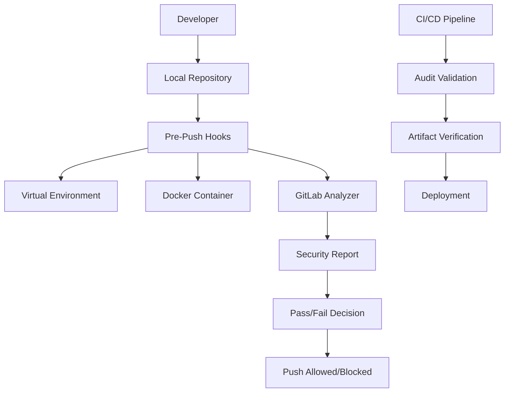

# 🔧 **Guia para Administradores**

## 🎯 **Visão Geral**

Este guia é destinado a administradores de sistemas, DevOps e líderes técnicos que precisam implementar, gerenciar e manter o sistema de Git Hooks Central em uma organização.

## 📋 **Índice**

1. [Arquitetura do Sistema](#-arquitetura-do-sistema)
2. [Implementação Organizacional](#-implementação-organizacional)
3. [Gerenciamento de Versões](#-gerenciamento-de-versões)
4. [Monitoramento e Logs](#-monitoramento-e-logs)
5. [Políticas de Segurança](#-políticas-de-segurança)
6. [Integração CI/CD](#-integração-cicd)
7. [Troubleshooting Avançado](#-troubleshooting-avançado)
8. [Manutenção e Atualizações](#-manutenção-e-atualizações)

---

## 🏗️ **Arquitetura do Sistema**

### **Componentes Principais**



### **Fluxo de Dados**

1. **Desenvolvedor** faz push
2. **Pre-push hooks** executam automaticamente
3. **Virtual Environment** é criado/gerenciado automaticamente
4. **Docker Container** executa GitLab Secrets Analyzer
5. **Relatório de segurança** é gerado
6. **Decisão** é tomada baseada nos resultados
7. **Push** é permitido ou bloqueado

### **Arquivos e Diretórios**

```
projeto/
├── .pre-commit-config.yaml     # Configuração dos hooks
├── .gitignore                  # Ignora .venv/ e relatórios
├── .venv/                      # Virtual environment (auto-criado)
├── .git/hooks_artifacts/       # Artefatos de auditoria
│   └── prepush.json           # Metadados da execução
├── gl-secret-detection-report.json  # Relatório de segredos
└── hooks/                      # Scripts locais (se houver)
```

---

## 🏢 **Implementação Organizacional**

### **Estratégia de Rollout**

#### **Fase 1: Piloto (2-4 semanas)**
```bash
# Selecionar 2-3 projetos piloto
# Configurar hooks básicos
# Treinar desenvolvedores
# Coletar feedback
```

#### **Fase 2: Expansão (4-8 semanas)**
```bash
# Implementar em 50% dos projetos
# Configurar CI/CD integration
# Estabelecer métricas
# Refinar processos
```

#### **Fase 3: Produção (8-12 semanas)**
```bash
# Implementar em todos os projetos
# Configurar monitoramento
# Estabelecer SLAs
# Documentar processos
```

### **Template Organizacional**

#### **Configuração Padrão (.pre-commit-config.yaml)**
```yaml
repos:
  # Hooks básicos (obrigatórios)
  - repo: https://github.com/pre-commit/pre-commit-hooks
    rev: v6.0.0
    hooks:
      - id: end-of-file-fixer
        stages: [pre-push]
      - id: check-json
        stages: [pre-push]
      - id: check-yaml
        stages: [pre-push]
      - id: detect-private-key
        stages: [pre-push]

  # Catálogo central (SEMPRE usar tag específica)
  - repo: https://github.com/pcnuness/git-hooks-central.git
    rev: v1.0.3  # ⚠️ NUNCA usar main ou latest
    hooks:
      - id: branch-ahead-check
        stages: [pre-push]
        pass_filenames: false
      
      - id: audit-trail
        stages: [pre-push]
        pass_filenames: false
      
      - id: secrets-detection-gitlab
        stages: [pre-push]
        always_run: true
        pass_filenames: false

  # Hooks específicos por stack (configurar conforme necessário)
  # Node.js
  - repo: https://github.com/pre-commit/mirrors-eslint
    rev: v9.34.0
    hooks:
      - id: eslint
        additional_dependencies: ['eslint@9.9.0']
        files: \.(js|jsx|ts|tsx)$
        stages: [pre-push]
        args: [--fix]

  # Java
  - repo: https://github.com/checkstyle/checkstyle
    rev: v10.12.4
    hooks:
      - id: checkstyle
        stages: [pre-push]
        files: \.java$

  # Python
  - repo: https://github.com/psf/black
    rev: 25.1.0
    hooks:
      - id: black
        stages: [pre-push]
```

### **Políticas Organizacionais**

#### **1. Política de Versões**
```bash
# SEMPRE usar tags específicas
rev: v1.0.3  # ✅ Correto
rev: main    # ❌ Proibido
rev: latest  # ❌ Proibido

# Processo de atualização:
# 1. Testar nova versão em projeto piloto
# 2. Validar compatibilidade
# 3. Comunicar mudanças
# 4. Atualizar gradualmente
```

#### **2. Política de Bypass**
```bash
# Bypass é permitido APENAS em:
# - Emergências de produção
# - Hotfixes críticos
# - Com aprovação de 2+ pessoas

# Processo de bypass:
# 1. Documentar justificativa
# 2. Obter aprovação
# 3. Executar git push --no-verify
# 4. Revisar e corrigir posteriormente
```

#### **3. Política de Segredos**
```bash
# Se segredos forem detectados:
# 1. BLOQUEAR push imediatamente
# 2. Rotacionar credenciais
# 3. Investigar vazamento
# 4. Notificar equipe de segurança
# 5. Atualizar processos
```

---

## 🔄 **Gerenciamento de Versões**

### **Estratégia de Versionamento**

#### **Semantic Versioning**
```bash
# Formato: vMAJOR.MINOR.PATCH
v1.0.0  # Primeira versão estável
v1.0.1  # Bug fixes
v1.1.0  # Novas funcionalidades
v2.0.0  # Breaking changes
```

#### **Processo de Release**
```bash
# 1. Desenvolvimento em branch feature
git checkout -b feature/nova-funcionalidade

# 2. Testes e validação
pre-commit run --all-files --hook-stage push

# 3. Merge para main
git checkout main
git merge feature/nova-funcionalidade

# 4. Criar tag
git tag -a v1.1.0 -m "Release v1.1.0: Nova funcionalidade"
git push origin v1.1.0

# 5. Atualizar documentação
# 6. Comunicar mudanças
```

#### **Processo de Atualização da Tag Latest**
```bash
# 1. Listar tags existentes
git tag                        
git ls-remote --tags origin 

# 2. Deletar tag latest (se existir)
git tag -d latest
git push origin --delete latest

# 3. Criar nova tag latest
git add -A
git commit -m "Release: secret detection"
git tag -a latest -m "Release: secret detection"

# 4. Push da tag e commits
git push origin latest  
git push
```

**⚠️ Importante**: A tag `latest` deve ser usada apenas para releases estáveis e testadas. Sempre teste localmente antes de atualizar a tag `latest`.

### **Matriz de Compatibilidade**

| Versão | Python | Docker | pre-commit | Status |
|--------|--------|--------|------------|--------|
| latest | 3.6+ | 20.0+ | 3.0+ | ✅ Atual |

### **Plano de Atualização**

#### **Atualização Manual**
```bash
# 1. Verificar versões disponíveis
git ls-remote --tags https://github.com/pcnuness/git-hooks-central.git

# 2. Atualizar .pre-commit-config.yaml
# Mudar rev: develop para rev: latest

# 3. Limpar cache e reinstalar
pre-commit clean
pre-commit install --hook-type pre-push

# 4. Testar
pre-commit run --all-files --hook-stage push
```

---

## 📊 **Monitoramento e Logs**

### **Métricas Importantes**

#### **1. Métricas de Execução**
```bash
# Taxa de sucesso dos hooks
# Tempo médio de execução
# Número de segredos detectados
# Número de bypasses utilizados
```

#### **2. Métricas de Segurança**
```bash
# Tipos de segredos detectados
# Severidade das vulnerabilidades
# Frequência de detecções
# Tempo de resposta a incidentes
```

### **Sistema de Logs**

#### **Estrutura de Logs**
```bash
# Logs locais
gl-secret-detection-report.json
```

#### **Configuração de Logs Centralizados**
```bash
# Script de coleta de logs
#!/bin/bash
# collect-logs.sh

LOG_DIR="/var/log/git-hooks"
DATE=$(date +%Y%m%d_%H%M%S)

# Coletar logs de todos os projetos
find /path/to/projects -name "prepush.json" -exec cp {} $LOG_DIR/audit_${DATE}_{}.json \;
find /path/to/projects -name "gl-secret-detection-report.json" -exec cp {} $LOG_DIR/security_${DATE}_{}.json \;

# Rotacionar logs antigos
find $LOG_DIR -name "*.json" -mtime +30 -delete
```

### **Dashboard de Monitoramento**

#### **Métricas em Tempo Real**
```bash
# Script de dashboard
#!/bin/bash
# dashboard.sh

echo "=== Git Hooks Central Dashboard ==="
echo "Data: $(date)"
echo

# Estatísticas gerais
TOTAL_PROJECTS=$(find /path/to/projects -name ".pre-commit-config.yaml" | wc -l)
ACTIVE_HOOKS=$(find /path/to/projects -name "prepush.json" | wc -l)
SECRETS_DETECTED=$(find /path/to/projects -name "gl-secret-detection-report.json" -exec jq '.vulnerabilities | length' {} \; | awk '{sum+=$1} END {print sum}')

echo "Projetos configurados: $TOTAL_PROJECTS"
echo "Hooks ativos: $ACTIVE_HOOKS"
echo "Segredos detectados (últimas 24h): $SECRETS_DETECTED"
echo

# Top 5 tipos de segredos
echo "=== Top 5 Tipos de Segredos ==="
find /path/to/projects -name "gl-secret-detection-report.json" -exec jq -r '.vulnerabilities[].name' {} \; | sort | uniq -c | sort -nr | head -5
```

## 🔧 **Troubleshooting Avançado**

### **Problemas de Performance**

#### **1. Hooks Lentos**
```bash
# Diagnóstico
time pre-commit run --all-files --hook-stage push
```

#### **2. Docker Overhead**
```bash
# Configurar cache do Docker
docker system prune -f
docker builder prune -f
```

### **Problemas de Compatibilidade**

#### **1. Versões de Python**
```bash
# Verificar compatibilidade
python3 --version
python3 -c "import sys; print(sys.version_info >= (3, 6))"

# Solução: Usar pyenv
pyenv install 3.11.0
pyenv global 3.11.0
```

#### **2. Problemas de Permissão**
```bash
# Verificar permissões
ls -la .git/hooks/
ls -la hooks/

# Corrigir permissões
chmod +x hooks/*.sh
chmod +x hooks/*.py
```

### **Problemas de Rede**

#### **1. Falha no Download de Imagens**
```bash
# Verificar conectividade
docker pull registry.gitlab.com/gitlab-org/security-products/analyzers/secrets:latest

```

#### **2. Falha no Acesso ao Repositório**
```bash
# Verificar acesso
git ls-remote https://github.com/pcnuness/git-hooks-central.git

# Configurar autenticação se necessário
git config --global credential.helper store
```

---

## 🎉 **Conclusão**

Este guia fornece todas as informações necessárias para implementar, gerenciar e manter o sistema de Git Hooks Central em uma organização. Com as políticas, processos e scripts fornecidos, os administradores podem garantir que o sistema funcione de forma eficiente e segura.

