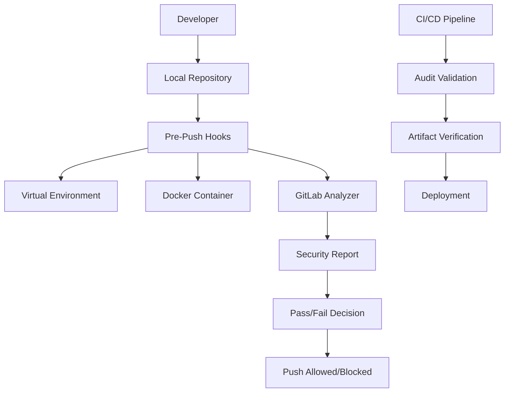

# 🔧 **Guia para Administradores**

## 🎯 **Visão Geral**

Este guia é destinado a administradores de sistemas, DevOps e líderes técnicos que precisam implementar, gerenciar e manter o sistema de Git Hooks Central em uma organização.

## 📋 **Índice**

1. [Arquitetura do Sistema](#-arquitetura-do-sistema)
2. [Implementação Organizacional](#-implementação-organizacional)
3. [Gerenciamento de Versões](#-gerenciamento-de-versões)
4. [Monitoramento e Logs](#-monitoramento-e-logs)
5. [Políticas de Segurança](#-políticas-de-segurança)
6. [Integração CI/CD](#-integração-cicd)
7. [Troubleshooting Avançado](#-troubleshooting-avançado)
8. [Manutenção e Atualizações](#-manutenção-e-atualizações)

---

## 🏗️ **Arquitetura do Sistema**

### **Componentes Principais**



### **Fluxo de Dados**

1. **Desenvolvedor** faz push
2. **Pre-push hooks** executam automaticamente
3. **Virtual Environment** é criado/gerenciado automaticamente
4. **Docker Container** executa GitLab Secrets Analyzer
5. **Relatório de segurança** é gerado
6. **Decisão** é tomada baseada nos resultados
7. **Push** é permitido ou bloqueado

### **Arquivos e Diretórios**

```
projeto/
├── .pre-commit-config.yaml     # Configuração dos hooks
├── .gitignore                  # Ignora .venv/ e relatórios
├── .venv/                      # Virtual environment (auto-criado)
├── .git/hooks_artifacts/       # Artefatos de auditoria
│   └── prepush.json           # Metadados da execução
├── gl-secret-detection-report.json  # Relatório de segredos
└── hooks/                      # Scripts locais (se houver)
```

---

## 🏢 **Implementação Organizacional**

### **Estratégia de Rollout**

#### **Fase 1: Piloto (2-4 semanas)**
```bash
# Selecionar 2-3 projetos piloto
# Configurar hooks básicos
# Treinar desenvolvedores
# Coletar feedback
```

#### **Fase 2: Expansão (4-8 semanas)**
```bash
# Implementar em 50% dos projetos
# Configurar CI/CD integration
# Estabelecer métricas
# Refinar processos
```

#### **Fase 3: Produção (8-12 semanas)**
```bash
# Implementar em todos os projetos
# Configurar monitoramento
# Estabelecer SLAs
# Documentar processos
```

### **Template Organizacional**

#### **Configuração Padrão (.pre-commit-config.yaml)**
```yaml
repos:
  # Hooks básicos (obrigatórios)
  - repo: https://github.com/pre-commit/pre-commit-hooks
    rev: v6.0.0
    hooks:
      - id: end-of-file-fixer
        stages: [pre-push]
      - id: check-json
        stages: [pre-push]
      - id: check-yaml
        stages: [pre-push]
      - id: detect-private-key
        stages: [pre-push]

  # Catálogo central (SEMPRE usar tag específica)
  - repo: https://github.com/pcnuness/git-hooks-central.git
    rev: v1.0.3  # ⚠️ NUNCA usar main ou latest
    hooks:
      - id: branch-ahead-check
        stages: [pre-push]
        pass_filenames: false
      
      - id: audit-trail
        stages: [pre-push]
        pass_filenames: false
      
      - id: secrets-detection-gitlab
        stages: [pre-push]
        always_run: true
        pass_filenames: false

  # Hooks específicos por stack (configurar conforme necessário)
  # Node.js
  - repo: https://github.com/pre-commit/mirrors-eslint
    rev: v9.34.0
    hooks:
      - id: eslint
        additional_dependencies: ['eslint@9.9.0']
        files: \.(js|jsx|ts|tsx)$
        stages: [pre-push]
        args: [--fix]

  # Java
  - repo: https://github.com/checkstyle/checkstyle
    rev: v10.12.4
    hooks:
      - id: checkstyle
        stages: [pre-push]
        files: \.java$

  # Python
  - repo: https://github.com/psf/black
    rev: 25.1.0
    hooks:
      - id: black
        stages: [pre-push]
```

### **Políticas Organizacionais**

#### **1. Política de Versões**
```bash
# SEMPRE usar tags específicas
rev: v1.0.3  # ✅ Correto
rev: main    # ❌ Proibido
rev: latest  # ❌ Proibido

# Processo de atualização:
# 1. Testar nova versão em projeto piloto
# 2. Validar compatibilidade
# 3. Comunicar mudanças
# 4. Atualizar gradualmente
```

#### **2. Política de Bypass**
```bash
# Bypass é permitido APENAS em:
# - Emergências de produção
# - Hotfixes críticos
# - Com aprovação de 2+ pessoas

# Processo de bypass:
# 1. Documentar justificativa
# 2. Obter aprovação
# 3. Executar git push --no-verify
# 4. Revisar e corrigir posteriormente
```

#### **3. Política de Segredos**
```bash
# Se segredos forem detectados:
# 1. BLOQUEAR push imediatamente
# 2. Rotacionar credenciais
# 3. Investigar vazamento
# 4. Notificar equipe de segurança
# 5. Atualizar processos
```

---

## 🔄 **Gerenciamento de Versões**

### **Estratégia de Versionamento**

#### **Semantic Versioning**
```bash
# Formato: vMAJOR.MINOR.PATCH
v1.0.0  # Primeira versão estável
v1.0.1  # Bug fixes
v1.1.0  # Novas funcionalidades
v2.0.0  # Breaking changes
```

#### **Processo de Release**
```bash
# 1. Desenvolvimento em branch feature
git checkout -b feature/nova-funcionalidade

# 2. Testes e validação
pre-commit run --all-files --hook-stage push

# 3. Merge para main
git checkout main
git merge feature/nova-funcionalidade

# 4. Criar tag
git tag -a v1.1.0 -m "Release v1.1.0: Nova funcionalidade"
git push origin v1.1.0

# 5. Atualizar documentação
# 6. Comunicar mudanças
```

### **Matriz de Compatibilidade**

| Versão | Python | Docker | pre-commit | Status |
|--------|--------|--------|------------|--------|
| v1.0.3 | 3.6+ | 20.0+ | 3.0+ | ✅ Atual |
| v1.0.2 | 3.6+ | 20.0+ | 3.0+ | ✅ Suportada |
| v1.0.1 | 3.6+ | 20.0+ | 3.0+ | ⚠️ Deprecada |
| v1.0.0 | 3.6+ | 20.0+ | 3.0+ | ❌ Descontinuada |

### **Plano de Atualização**

#### **Atualização Automática (Recomendado)**
```bash
# Script de atualização automática
#!/bin/bash
# update-hooks.sh

CURRENT_VERSION=$(grep "rev: v" .pre-commit-config.yaml | cut -d' ' -f2)
LATEST_VERSION=$(git ls-remote --tags https://github.com/pcnuness/git-hooks-central.git | tail -1 | cut -d'/' -f3)

if [ "$CURRENT_VERSION" != "$LATEST_VERSION" ]; then
    echo "Atualizando de $CURRENT_VERSION para $LATEST_VERSION"
    sed -i "s/$CURRENT_VERSION/$LATEST_VERSION/g" .pre-commit-config.yaml
    pre-commit clean
    pre-commit install --hook-type pre-push
    echo "Atualização concluída!"
else
    echo "Já está na versão mais recente: $CURRENT_VERSION"
fi
```

#### **Atualização Manual**
```bash
# 1. Verificar versões disponíveis
git ls-remote --tags https://github.com/pcnuness/git-hooks-central.git

# 2. Atualizar .pre-commit-config.yaml
# Mudar rev: v1.0.3 para rev: v1.1.0

# 3. Limpar cache e reinstalar
pre-commit clean
pre-commit install --hook-type pre-push

# 4. Testar
pre-commit run --all-files --hook-stage push
```

---

## 📊 **Monitoramento e Logs**

### **Métricas Importantes**

#### **1. Métricas de Execução**
```bash
# Taxa de sucesso dos hooks
# Tempo médio de execução
# Número de segredos detectados
# Número de bypasses utilizados
```

#### **2. Métricas de Segurança**
```bash
# Tipos de segredos detectados
# Severidade das vulnerabilidades
# Frequência de detecções
# Tempo de resposta a incidentes
```

### **Sistema de Logs**

#### **Estrutura de Logs**
```bash
# Logs locais
.git/hooks_artifacts/prepush.json
gl-secret-detection-report.json

# Logs centralizados (recomendado)
/var/log/git-hooks/
├── execution.log
├── security.log
├── errors.log
└── audit.log
```

#### **Configuração de Logs Centralizados**
```bash
# Script de coleta de logs
#!/bin/bash
# collect-logs.sh

LOG_DIR="/var/log/git-hooks"
DATE=$(date +%Y%m%d_%H%M%S)

# Coletar logs de todos os projetos
find /path/to/projects -name "prepush.json" -exec cp {} $LOG_DIR/audit_${DATE}_{}.json \;
find /path/to/projects -name "gl-secret-detection-report.json" -exec cp {} $LOG_DIR/security_${DATE}_{}.json \;

# Rotacionar logs antigos
find $LOG_DIR -name "*.json" -mtime +30 -delete
```

### **Dashboard de Monitoramento**

#### **Métricas em Tempo Real**
```bash
# Script de dashboard
#!/bin/bash
# dashboard.sh

echo "=== Git Hooks Central Dashboard ==="
echo "Data: $(date)"
echo

# Estatísticas gerais
TOTAL_PROJECTS=$(find /path/to/projects -name ".pre-commit-config.yaml" | wc -l)
ACTIVE_HOOKS=$(find /path/to/projects -name "prepush.json" | wc -l)
SECRETS_DETECTED=$(find /path/to/projects -name "gl-secret-detection-report.json" -exec jq '.vulnerabilities | length' {} \; | awk '{sum+=$1} END {print sum}')

echo "Projetos configurados: $TOTAL_PROJECTS"
echo "Hooks ativos: $ACTIVE_HOOKS"
echo "Segredos detectados (últimas 24h): $SECRETS_DETECTED"
echo

# Top 5 tipos de segredos
echo "=== Top 5 Tipos de Segredos ==="
find /path/to/projects -name "gl-secret-detection-report.json" -exec jq -r '.vulnerabilities[].name' {} \; | sort | uniq -c | sort -nr | head -5
```

---

## 🔒 **Políticas de Segurança**

### **Classificação de Segredos**

#### **Níveis de Severidade**
```bash
# Critical: Chaves privadas, tokens de acesso
# High: Senhas, API keys
# Medium: Tokens de sessão, cookies
# Low: URLs, configurações
```

#### **Ações por Severidade**
```bash
# Critical: BLOQUEAR push + Investigação imediata
# High: BLOQUEAR push + Rotação de credenciais
# Medium: ALERTAR + Revisão obrigatória
# Low: LOGAR + Revisão opcional
```

### **Política de Resposta a Incidentes**

#### **Processo de Resposta**
```bash
# 1. DETECÇÃO
# - Hook detecta segredo
# - Push é bloqueado
# - Alerta é gerado

# 2. ANÁLISE
# - Classificar severidade
# - Identificar tipo de segredo
# - Rastrear origem

# 3. CONTENÇÃO
# - Rotacionar credenciais
# - Bloquear acesso se necessário
# - Notificar equipe de segurança

# 4. ERADICAÇÃO
# - Remover segredo do código
# - Atualizar processos
# - Treinar desenvolvedores

# 5. RECUPERAÇÃO
# - Validar correções
# - Restaurar funcionalidades
# - Monitorar continuamente

# 6. LIÇÕES APRENDIDAS
# - Documentar incidente
# - Atualizar políticas
# - Melhorar processos
```

### **Auditoria e Compliance**

#### **Requisitos de Auditoria**
```bash
# 1. Logs de execução
# - Timestamp de cada execução
# - Resultado (pass/fail)
# - Detalhes dos segredos detectados

# 2. Rastreabilidade
# - Quem executou o push
# - Qual branch foi afetada
# - Quais arquivos foram modificados

# 3. Evidências
# - Artefatos de auditoria
# - Relatórios de segurança
# - Logs de bypass (se houver)
```

#### **Relatórios de Compliance**
```bash
# Script de relatório mensal
#!/bin/bash
# monthly-report.sh

MONTH=$(date +%Y-%m)
REPORT_FILE="compliance-report-${MONTH}.md"

cat > $REPORT_FILE << EOF
# Relatório de Compliance - $MONTH

## Resumo Executivo
- Total de execuções: $(find /var/log/git-hooks -name "audit_${MONTH}*" | wc -l)
- Taxa de sucesso: $(calculate_success_rate)
- Segredos detectados: $(find /var/log/git-hooks -name "security_${MONTH}*" -exec jq '.vulnerabilities | length' {} \; | awk '{sum+=$1} END {print sum}')

## Detalhes por Projeto
$(generate_project_details)

## Recomendações
$(generate_recommendations)
EOF
```

---

## 🔄 **Integração CI/CD**

### **Estratégia de Integração**

#### **1. Validação no Pipeline**
```yaml
# .github/workflows/security-validation.yml
name: Security Validation

on:
  pull_request:
    branches: [ main, develop ]

jobs:
  security-check:
    runs-on: ubuntu-latest
    steps:
    - uses: actions/checkout@v4
    
    - name: Set up Python
      uses: actions/setup-python@v4
      with:
        python-version: '3.11'
    
    - name: Install pre-commit
      run: pip install pre-commit
    
    - name: Run security hooks
      run: pre-commit run --all-files --hook-stage push
    
    - name: Validate audit artifact
      run: |
        if [ -f .git/hooks_artifacts/prepush.json ]; then
          echo "✅ Audit artifact found"
          # Validar integridade do artefato
          jq '.status' .git/hooks_artifacts/prepush.json
        else
          echo "❌ Audit artifact missing"
          exit 1
        fi
    
    - name: Upload security reports
      uses: actions/upload-artifact@v3
      with:
        name: security-reports
        path: |
          .git/hooks_artifacts/
          gl-secret-detection-report.json
```

#### **2. Validação de Artefatos**
```bash
# Script de validação de artefatos
#!/bin/bash
# validate-artifacts.sh

ARTIFACT_FILE=".git/hooks_artifacts/prepush.json"

if [ ! -f "$ARTIFACT_FILE" ]; then
    echo "❌ Audit artifact missing"
    exit 1
fi

# Validar estrutura do JSON
if ! jq empty "$ARTIFACT_FILE" 2>/dev/null; then
    echo "❌ Invalid JSON format"
    exit 1
fi

# Validar campos obrigatórios
REQUIRED_FIELDS=("commit" "author" "date" "precommit_config_sha1" "status")
for field in "${REQUIRED_FIELDS[@]}"; do
    if ! jq -e ".$field" "$ARTIFACT_FILE" > /dev/null; then
        echo "❌ Missing required field: $field"
        exit 1
    fi
done

# Validar status
STATUS=$(jq -r '.status' "$ARTIFACT_FILE")
if [ "$STATUS" != "passed-local" ]; then
    echo "❌ Invalid status: $STATUS"
    exit 1
fi

echo "✅ Audit artifact is valid"
```

### **Integração com Ferramentas de Segurança**

#### **1. SIEM Integration**
```bash
# Script de integração com SIEM
#!/bin/bash
# siem-integration.sh

# Coletar eventos de segurança
find /path/to/projects -name "gl-secret-detection-report.json" -newer /tmp/last_siem_sync | while read file; do
    # Enviar para SIEM
    curl -X POST "$SIEM_ENDPOINT" \
        -H "Content-Type: application/json" \
        -H "Authorization: Bearer $SIEM_TOKEN" \
        -d @"$file"
done

# Atualizar timestamp
touch /tmp/last_siem_sync
```

#### **2. Slack Integration**
```bash
# Script de notificação Slack
#!/bin/bash
# slack-notification.sh

SECRETS_COUNT=$(find /path/to/projects -name "gl-secret-detection-report.json" -exec jq '.vulnerabilities | length' {} \; | awk '{sum+=$1} END {print sum}')

if [ "$SECRETS_COUNT" -gt 0 ]; then
    curl -X POST "$SLACK_WEBHOOK" \
        -H "Content-Type: application/json" \
        -d "{
            \"text\": \"🚨 $SECRETS_COUNT secrets detected in the last 24 hours\",
            \"channel\": \"#security-alerts\"
        }"
fi
```

---

## 🔧 **Troubleshooting Avançado**

### **Problemas de Performance**

#### **1. Hooks Lentos**
```bash
# Diagnóstico
time pre-commit run --all-files --hook-stage push

# Otimizações
# - Reduzir número de arquivos processados
# - Usar cache do Docker
# - Otimizar regras de detecção
```

#### **2. Docker Overhead**
```bash
# Configurar cache do Docker
docker system prune -f
docker builder prune -f

# Usar imagens menores
# - Alpine Linux base
# - Multi-stage builds
```

### **Problemas de Compatibilidade**

#### **1. Versões de Python**
```bash
# Verificar compatibilidade
python3 --version
python3 -c "import sys; print(sys.version_info >= (3, 6))"

# Solução: Usar pyenv
pyenv install 3.11.0
pyenv global 3.11.0
```

#### **2. Problemas de Permissão**
```bash
# Verificar permissões
ls -la .git/hooks/
ls -la hooks/

# Corrigir permissões
chmod +x hooks/*.sh
chmod +x hooks/*.py
```

### **Problemas de Rede**

#### **1. Falha no Download de Imagens**
```bash
# Verificar conectividade
docker pull registry.gitlab.com/gitlab-org/security-products/analyzers/secrets:latest

# Configurar proxy se necessário
export HTTP_PROXY=http://proxy.company.com:8080
export HTTPS_PROXY=http://proxy.company.com:8080
```

#### **2. Falha no Acesso ao Repositório**
```bash
# Verificar acesso
git ls-remote https://github.com/pcnuness/git-hooks-central.git

# Configurar autenticação se necessário
git config --global credential.helper store
```

---

## 🔄 **Manutenção e Atualizações**

### **Cronograma de Manutenção**

#### **Diário**
```bash
# Verificar logs de erro
grep -r "ERROR" /var/log/git-hooks/

# Verificar espaço em disco
df -h /var/log/git-hooks/

# Verificar status do Docker
docker system df
```

#### **Semanal**
```bash
# Limpeza de logs antigos
find /var/log/git-hooks -name "*.json" -mtime +7 -delete

# Atualização de imagens Docker
docker pull registry.gitlab.com/gitlab-org/security-products/analyzers/secrets:latest

# Verificação de segurança
security-scan.sh
```

#### **Mensal**
```bash
# Relatório de compliance
monthly-report.sh

# Atualização de dependências
dependency-update.sh

# Backup de configurações
backup-configs.sh
```

### **Scripts de Manutenção**

#### **1. Limpeza Automática**
```bash
#!/bin/bash
# cleanup.sh

# Limpar cache do pre-commit
find /path/to/projects -name ".pre-commit" -type d -exec rm -rf {} +

# Limpar virtual environments antigos
find /path/to/projects -name ".venv" -type d -mtime +30 -exec rm -rf {} +

# Limpar relatórios antigos
find /path/to/projects -name "gl-secret-detection-report.json" -mtime +7 -delete

# Limpar logs antigos
find /var/log/git-hooks -name "*.json" -mtime +30 -delete
```

#### **2. Backup de Configurações**
```bash
#!/bin/bash
# backup-configs.sh

BACKUP_DIR="/backup/git-hooks/$(date +%Y%m%d)"
mkdir -p "$BACKUP_DIR"

# Backup de configurações
find /path/to/projects -name ".pre-commit-config.yaml" -exec cp {} "$BACKUP_DIR/" \;

# Backup de artefatos importantes
find /path/to/projects -name "prepush.json" -exec cp {} "$BACKUP_DIR/" \;

# Compressão
tar -czf "$BACKUP_DIR.tar.gz" "$BACKUP_DIR"
rm -rf "$BACKUP_DIR"
```

#### **3. Monitoramento de Saúde**
```bash
#!/bin/bash
# health-check.sh

# Verificar status dos serviços
check_service() {
    if systemctl is-active --quiet "$1"; then
        echo "✅ $1 is running"
    else
        echo "❌ $1 is not running"
        return 1
    fi
}

# Verificar serviços críticos
check_service docker
check_service git

# Verificar conectividade
if curl -s https://github.com/pcnuness/git-hooks-central.git > /dev/null; then
    echo "✅ Repository accessible"
else
    echo "❌ Repository not accessible"
fi

# Verificar espaço em disco
DISK_USAGE=$(df /var/log/git-hooks | tail -1 | awk '{print $5}' | sed 's/%//')
if [ "$DISK_USAGE" -gt 80 ]; then
    echo "⚠️ Disk usage high: ${DISK_USAGE}%"
else
    echo "✅ Disk usage OK: ${DISK_USAGE}%"
fi
```

---

## 📞 **Suporte e Contatos**

### **Níveis de Suporte**

#### **Nível 1: Desenvolvedores**
- **Responsabilidade**: Problemas básicos de configuração
- **Escalação**: Após 2 horas sem resolução

#### **Nível 2: Administradores**
- **Responsabilidade**: Problemas de sistema e integração
- **Escalação**: Após 4 horas sem resolução

#### **Nível 3: Especialistas**
- **Responsabilidade**: Problemas críticos e emergências
- **Escalação**: Imediata para problemas de segurança

### **Canais de Suporte**

- **Email**: git-hooks-support@company.com
- **Slack**: #git-hooks-support
- **Issues**: [GitHub Issues](https://github.com/pcnuness/git-hooks-central/issues)
- **Documentação**: [docs/](docs/)

### **SLA de Resposta**

| Severidade | Tempo de Resposta | Tempo de Resolução |
|------------|-------------------|-------------------|
| Critical | 15 minutos | 2 horas |
| High | 1 hora | 8 horas |
| Medium | 4 horas | 24 horas |
| Low | 24 horas | 72 horas |

---

## 🎉 **Conclusão**

Este guia fornece todas as informações necessárias para implementar, gerenciar e manter o sistema de Git Hooks Central em uma organização. Com as políticas, processos e scripts fornecidos, os administradores podem garantir que o sistema funcione de forma eficiente e segura.

**Lembre-se**: A segurança é um processo contínuo, não um destino. Mantenha-se atualizado, monitore constantemente e sempre busque melhorias! 🛡️

---

**Versão**: v1.0.3  
**Última atualização**: 2025-09-02  
**Próxima revisão**: 2025-10-02
