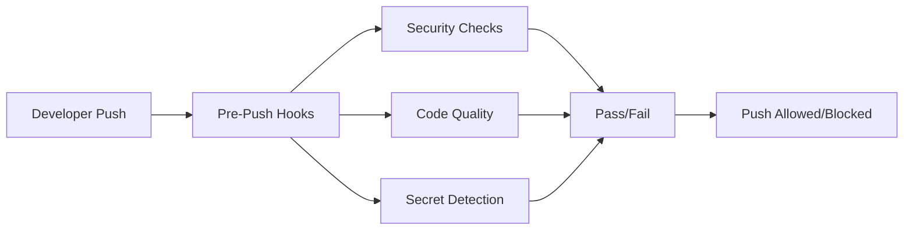

# 🚀 **Guia Completo de Uso - Git Hooks Central**

## 📋 **Índice**

1. [Visão Geral](#-visão-geral)
2. [Arquitetura](#-arquitetura)
3. [Instalação](#-instalação)
4. [Configuração](#-configuração)
5. [Hooks Disponíveis](#-hooks-disponíveis)
6. [Uso Diário](#-uso-diário)
7. [Troubleshooting](#-troubleshooting)
8. [Integração CI/CD](#-integração-cicd)
9. [Segurança](#-segurança)
10. [FAQ](#-faq)

---

## 🎯 **Visão Geral**

O **Git Hooks Central** é um sistema de hooks Git baseado no framework `pre-commit` que executa verificações de segurança e qualidade de código no estágio `pre-push`. O sistema é projetado para ser:

- ✅ **Multi-OS**: Windows, Linux, macOS
- ✅ **Auto-gerenciado**: Virtual environment e dependências automáticas
- ✅ **Escalável**: Catálogo central reutilizável
- ✅ **Seguro**: Detecção de segredos e vulnerabilidades
- ✅ **Auditável**: Rastreamento completo de execuções

### **Fluxo de Trabalho:**


---

## 🏗️ **Arquitetura**

### **Componentes Principais:**

#### **1. Catálogo Central**
```
https://github.com/pcnuness/git-hooks-central.git
├── hooks/                    # Scripts de hooks
├── .pre-commit-hooks.yaml   # Definição dos hooks
├── examples/                # Configurações de exemplo
└── docs/                    # Documentação
```

#### **2. Hooks Disponíveis**
- **`branch-ahead-check`**: Verifica se branch está atualizada
- **`audit-trail`**: Gera artefato auditável
- **`secrets-detection-gitlab`**: Detecção de segredos (Python Multi-OS)

#### **3. Tecnologias**
- **Framework**: pre-commit
- **Linguagem**: Python 3.6+ com Virtual Environment
- **Container**: Docker (GitLab Secrets Analyzer)
- **Multi-OS**: Compatível com Windows, Linux, macOS

---

## 🔧 **Instalação**

### **Pré-requisitos**

#### **Sistema Operacional:**
- **Windows**: Windows 10/11 com Python 3.6+
- **Linux**: Ubuntu 18.04+, CentOS 7+, RHEL 7+
- **macOS**: macOS 10.15+ com Python 3.6+

#### **Ferramentas Obrigatórias:**
```bash
# Python 3.6+ (obrigatório)
python3 --version  # Deve ser 3.6.0 ou superior

# Git (obrigatório)
git --version

# Docker (obrigatório para secrets detection)
docker --version
docker info  # Deve estar rodando
```

#### **Ferramentas Opcionais:**
```bash
# pre-commit (será instalado automaticamente)
pip install pre-commit

# jq (para melhor parsing JSON)
# Linux: sudo apt-get install jq
# macOS: brew install jq
# Windows: choco install jq
```

### **Instalação Passo a Passo**

#### **1. Clonar o Repositório de Exemplo**
```bash
# Criar repositório de teste
mkdir meu-projeto-seguro
cd meu-projeto-seguro
git init
```

#### **2. Configurar pre-commit**
```bash
# Instalar pre-commit
pip install pre-commit

# Criar .pre-commit-config.yaml
cat > .pre-commit-config.yaml << 'EOF'
repos:
  # Hooks nativos e rápidos
  - repo: https://github.com/pre-commit/pre-commit-hooks
    rev: v6.0.0
    hooks:
      - id: end-of-file-fixer
        stages: [pre-push]
      - id: check-json
        stages: [pre-push]
      - id: check-yaml
        stages: [pre-push]
      - id: detect-private-key
        stages: [pre-push]

  # Catálogo central de hooks de segurança
  - repo: https://github.com/pcnuness/git-hooks-central.git
    rev: v1.0.3  # ⚠️ SEMPRE usar tag específica
    hooks:
      - id: branch-ahead-check
        stages: [pre-push]
        pass_filenames: false
      
      - id: audit-trail
        stages: [pre-push]
        pass_filenames: false
      
      - id: secrets-detection-gitlab
        stages: [pre-push]
        always_run: true
        pass_filenames: false
EOF
```

#### **3. Instalar Hooks**
```bash
# Instalar hooks no repositório
pre-commit install --hook-type pre-push

# Verificar instalação
pre-commit --version
```

#### **4. Testar Instalação**
```bash
# Executar todos os hooks
pre-commit run --all-files --hook-stage push -v

# Resultado esperado: hooks executando sem erros
```

---

## ⚙️ **Configuração**

### **Configuração Básica (.pre-commit-config.yaml)**

```yaml
repos:
  # Hooks nativos (obrigatórios)
  - repo: https://github.com/pre-commit/pre-commit-hooks
    rev: v6.0.0
    hooks:
      - id: end-of-file-fixer
        stages: [pre-push]
      - id: check-json
        stages: [pre-push]
      - id: check-yaml
        stages: [pre-push]
      - id: detect-private-key
        stages: [pre-push]

  # Catálogo central (SEMPRE usar tag específica)
  - repo: https://github.com/pcnuness/git-hooks-central.git
    rev: v1.0.3  # ⚠️ NUNCA usar main ou latest
    hooks:
      - id: branch-ahead-check
        stages: [pre-push]
        pass_filenames: false
      
      - id: audit-trail
        stages: [pre-push]
        pass_filenames: false
      
      - id: secrets-detection-gitlab
        stages: [pre-push]
        always_run: true
        pass_filenames: false
```

### **Configuração Avançada**

#### **Para Projetos Node.js:**
```yaml
repos:
  # ... hooks básicos ...

  # Catálogo central
  - repo: https://github.com/pcnuness/git-hooks-central.git
    rev: v1.0.3
    hooks:
      - id: branch-ahead-check
        stages: [pre-push]
        pass_filenames: false
      
      - id: audit-trail
        stages: [pre-push]
        pass_filenames: false
      
      - id: secrets-detection-gitlab
        stages: [pre-push]
        always_run: true
        pass_filenames: false

  # Hooks específicos para Node.js
  - repo: https://github.com/pre-commit/mirrors-eslint
    rev: v9.34.0
    hooks:
      - id: eslint
        additional_dependencies: ['eslint@9.9.0']
        files: \.(js|jsx|ts|tsx)$
        stages: [pre-push]
        args: [--fix]
```

#### **Para Projetos Java:**
```yaml
repos:
  # ... hooks básicos ...

  # Catálogo central
  - repo: https://github.com/pcnuness/git-hooks-central.git
    rev: v1.0.3
    hooks:
      - id: branch-ahead-check
        stages: [pre-push]
        pass_filenames: false
      
      - id: audit-trail
        stages: [pre-push]
        pass_filenames: false
      
      - id: secrets-detection-gitlab
        stages: [pre-push]
        always_run: true
        pass_filenames: false

  # Hooks específicos para Java
  - repo: https://github.com/checkstyle/checkstyle
    rev: v10.12.4
    hooks:
      - id: checkstyle
        stages: [pre-push]
        files: \.java$
```

---

## 🔧 **Hooks Disponíveis**

### **Hooks do Catálogo Central**

| Hook ID | Descrição | Tempo Estimado | Dependências |
|---------|-----------|----------------|--------------|
| `branch-ahead-check` | Verifica se branch está atualizada com origin/main | <2s | Git |
| `audit-trail` | Gera artefato auditável (.git/hooks_artifacts/prepush.json) | <5s | Git |
| `secrets-detection-gitlab` | Detecção de segredos via GitLab Analyzer | <30s | Docker, Python 3.6+ |

### **Hooks Nativos (pre-commit-hooks)**

| Hook ID | Descrição | Tempo Estimado |
|---------|-----------|----------------|
| `end-of-file-fixer` | Corrige final de arquivos (newline) | <1s |
| `check-json` | Valida sintaxe JSON | <1s |
| `check-xml` | Valida sintaxe XML | <1s |
| `check-yaml` | Valida sintaxe YAML | <1s |
| `detect-private-key` | Detecta chaves privadas | <5s |

### **Detalhamento dos Hooks**

#### **1. branch-ahead-check**
```bash
# Verifica se a branch local está atualizada com origin/main
# Falha se: branch local está atrás da remota
# Sucesso se: branch local está atualizada ou à frente
```

#### **2. audit-trail**
```bash
# Gera arquivo: .git/hooks_artifacts/prepush.json
# Conteúdo:
{
  "commit": "abc123...",
  "author": "João Silva",
  "date": "2025-09-02T21:00:00Z",
  "precommit_config_sha1": "def456...",
  "status": "passed-local"
}
```

#### **3. secrets-detection-gitlab**
```bash
# Executa GitLab Secrets Analyzer via Docker
# Detecta: API keys, passwords, private keys, tokens
# Gera: gl-secret-detection-report.json
# Falha se: secrets detectados
# Sucesso se: nenhum secret encontrado
```

---

## 💻 **Uso Diário**

### **Fluxo de Trabalho Normal**

#### **1. Desenvolvimento**
```bash
# Fazer alterações no código
git add .
git commit -m "feat: nova funcionalidade"
```

#### **2. Push (Execução Automática dos Hooks)**
```bash
# Hooks executam automaticamente
git push origin feature-branch

# Se hooks falharem, push é bloqueado
# Se hooks passarem, push é permitido
```

#### **3. Execução Manual (Opcional)**
```bash
# Executar todos os hooks
pre-commit run --all-files --hook-stage push -v

# Executar hook específico
pre-commit run secrets-detection-gitlab --all-files --hook-stage push

# Executar em arquivos específicos
pre-commit run --files src/index.js --hook-stage push
```

### **Cenários Comuns**

#### **Cenário 1: Push Bem-sucedido**
```bash
$ git push origin feature-branch

[INFO] Configurando ambiente Python...
[SUCCESS] Ambiente Python configurado com sucesso
[INFO] Executando GitLab Secrets Analyzer...
[SUCCESS] Nenhum segredo sensível detectado
✅ Branch atualizada em relação a origin/main.
✅ Dependency audit rápido concluído.
✅ Artefato auditável salvo.

Enumerating objects: 3, done.
Counting objects: 100% (3/3), done.
Delta compression using up to 8 threads
Compressing objects: 100% (2/2), done.
Writing objects: 100% (2/2), 183 bytes | 183.00 KiB/s, done.
Total 2 (delta 1), reused 0 (delta 0), pack-reused 0
To https://github.com/user/repo.git
   abc123..def456  feature-branch -> feature-branch
```

#### **Cenário 2: Push Bloqueado por Segredos**
```bash
$ git push origin feature-branch

[INFO] Configurando ambiente Python...
[SUCCESS] Ambiente Python configurado com sucesso
[INFO] Executando GitLab Secrets Analyzer...
[ERROR] Secrets detectados: 2 vulnerabilidade(s)
[ERROR] Arquivo: gl-secret-detection-report.json
• RSA private key em src/index.js:14 (Severidade: Critical)
• AWS access token em src/index.js:11 (Severidade: Critical)
[ERROR] Revise e remova credenciais antes do push
[INFO] Dicas: rotacione chaves, use variáveis de ambiente, adicione ao .gitignore

error: failed to push some refs to 'https://github.com/user/repo.git'
hint: Updates were rejected because the pre-push hook failed
```

#### **Cenário 3: Branch Desatualizada**
```bash
$ git push origin feature-branch

❌ Branch não está atualizada em relação a origin/main.
❌ Execute: git pull origin main

error: failed to push some refs to 'https://github.com/user/repo.git'
hint: Updates were rejected because the pre-push hook failed
```

---

## 🔧 **Troubleshooting**

### **Problemas Comuns**

#### **1. Docker não encontrado**
```bash
# Erro:
[ERROR] Docker não encontrado ou não está em execução.

# Solução:
# Windows: Instalar Docker Desktop
# Linux: sudo apt-get install docker.io && sudo systemctl start docker
# macOS: brew install --cask docker
```

#### **2. Python não encontrado**
```bash
# Erro:
python3: command not found

# Solução:
# Windows: Instalar Python 3.6+ do python.org
# Linux: sudo apt-get install python3
# macOS: brew install python3
```

#### **3. Virtual Environment falha**
```bash
# Erro:
[ERROR] Falha ao criar virtual environment

# Solução:
# Verificar permissões
chmod +x hooks/secrets_detection_wrapper.py

# Verificar Python
python3 --version  # Deve ser 3.6.0+
```

#### **4. Hooks não executam**
```bash
# Erro:
pre-commit: command not found

# Solução:
pip install pre-commit
pre-commit install --hook-type pre-push
```

#### **5. Cache corrompido**
```bash
# Limpar cache do pre-commit
pre-commit clean

# Reinstalar hooks
pre-commit install --hook-type pre-push
```

### **Comandos de Diagnóstico**

#### **Verificar Instalação**
```bash
# Verificar pre-commit
pre-commit --version

# Verificar hooks instalados
ls -la .git/hooks/

# Verificar configuração
cat .pre-commit-config.yaml
```

#### **Verificar Dependências**
```bash
# Verificar Python
python3 --version

# Verificar Docker
docker --version
docker info

# Verificar Git
git --version
```

#### **Verificar Logs**
```bash
# Executar com verbose
pre-commit run --all-files --hook-stage push -v

# Verificar artefatos
ls -la .git/hooks_artifacts/
cat .git/hooks_artifacts/prepush.json

# Verificar relatórios
ls -la gl-secret-detection-report.json
```

---

## 🔄 **Integração CI/CD**

### **GitHub Actions**

```yaml
# .github/workflows/pre-commit-validation.yml
name: Pre-commit Validation

on:
  pull_request:
    branches: [ main, develop ]

jobs:
  pre-commit:
    runs-on: ubuntu-latest
    steps:
    - uses: actions/checkout@v4
    
    - name: Set up Python
      uses: actions/setup-python@v4
      with:
        python-version: '3.11'
    
    - name: Install pre-commit
      run: pip install pre-commit
    
    - name: Run pre-commit
      run: pre-commit run --all-files --hook-stage push
    
    - name: Validate audit artifact
      run: |
        if [ -f .git/hooks_artifacts/prepush.json ]; then
          echo "✅ Audit artifact found"
          cat .git/hooks_artifacts/prepush.json
        else
          echo "❌ Audit artifact missing"
          exit 1
        fi
```

### **GitLab CI**

```yaml
# .gitlab-ci.yml
stages:
  - pre-commit

pre-commit-validation:
  stage: pre-commit
  image: python:3.11
  before_script:
    - pip install pre-commit
  script:
    - pre-commit run --all-files --hook-stage push
    - |
      if [ -f .git/hooks_artifacts/prepush.json ]; then
        echo "✅ Audit artifact found"
        cat .git/hooks_artifacts/prepush.json
      else
        echo "❌ Audit artifact missing"
        exit 1
      fi
  rules:
    - if: $CI_PIPELINE_SOURCE == "merge_request_event"
```

### **Azure DevOps**

```yaml
# azure-pipelines.yml
trigger:
- main
- develop

pool:
  vmImage: 'ubuntu-latest'

steps:
- task: UsePythonVersion@0
  inputs:
    versionSpec: '3.11'

- script: |
    pip install pre-commit
    pre-commit run --all-files --hook-stage push
  displayName: 'Run pre-commit hooks'

- script: |
    if [ -f .git/hooks_artifacts/prepush.json ]; then
      echo "✅ Audit artifact found"
      cat .git/hooks_artifacts/prepush.json
    else
      echo "❌ Audit artifact missing"
      exit 1
    fi
  displayName: 'Validate audit artifact'
```

---

## 🔒 **Segurança**

### **Medidas de Segurança Implementadas**

#### **1. Detecção de Segredos**
- **GitLab Secrets Analyzer**: Detecção avançada de credenciais
- **Multi-pattern**: Detecta API keys, passwords, tokens, chaves privadas
- **Severidade**: Classificação por criticidade (Critical, High, Medium, Low)

#### **2. Prevenção de Bypass**
- **Artefato auditável**: Rastreamento de execuções
- **CI/CD validation**: Validação no pipeline
- **Server-side hooks**: Última linha de defesa

#### **3. Isolamento**
- **Virtual Environment**: Dependências isoladas
- **Docker containers**: Execução isolada
- **Multi-OS**: Compatibilidade sem comprometer segurança

### **Boas Práticas**

#### **1. Gerenciamento de Segredos**
```bash
# ❌ NUNCA fazer:
const apiKey = "sk-1234567890abcdef";

# ✅ SEMPRE fazer:
const apiKey = process.env.API_KEY;
```

#### **2. Configuração de .gitignore**
```bash
# Adicionar ao .gitignore:
.env
.env.local
.env.production
*.pem
*.key
secrets/
config/secrets.json
```

#### **3. Rotação de Credenciais**
```bash
# Se segredos forem detectados:
# 1. Rotacionar imediatamente
# 2. Remover do código
# 3. Usar variáveis de ambiente
# 4. Atualizar documentação
```

---

## ❓ **FAQ**

### **Perguntas Frequentes**

#### **Q: Por que usar pre-push em vez de pre-commit?**
**A:** Pre-push é mais eficiente porque:
- Executa apenas quando código está pronto para push
- Evita execuções desnecessárias durante desenvolvimento
- Permite commits locais para testes
- Melhor experiência do desenvolvedor

#### **Q: Como atualizar para nova versão do catálogo?**
**A:** 
```bash
# 1. Verificar tags disponíveis
git ls-remote --tags https://github.com/pcnuness/git-hooks-central.git

# 2. Atualizar .pre-commit-config.yaml
# Mudar rev: v1.0.3 para rev: v1.0.4

# 3. Limpar cache e reinstalar
pre-commit clean
pre-commit install --hook-type pre-push
```

#### **Q: Posso desabilitar hooks temporariamente?**
**A:** 
```bash
# Opção 1: Bypass com flag
git push --no-verify

# Opção 2: Comentar no .pre-commit-config.yaml
# - id: secrets-detection-gitlab
#   stages: [pre-push]

# ⚠️ CUIDADO: Use apenas em emergências
```

#### **Q: Como debugar hooks que falham?**
**A:**
```bash
# 1. Executar com verbose
pre-commit run --all-files --hook-stage push -v

# 2. Executar hook específico
pre-commit run secrets-detection-gitlab --all-files --hook-stage push

# 3. Verificar logs
cat .git/hooks_artifacts/prepush.json
cat gl-secret-detection-report.json
```

#### **Q: Hooks são executados em todos os arquivos?**
**A:** Depende da configuração:
- `always_run: true` → Executa em todos os arquivos
- `pass_filenames: false` → Não passa lista de arquivos
- Sem essas opções → Executa apenas em arquivos modificados

#### **Q: Como personalizar regras de detecção de segredos?**
**A:** O GitLab Secrets Analyzer usa regras padrão. Para personalizar:
```bash
# Criar arquivo de configuração
cat > .gitlab/secret-detection-ruleset.toml << 'EOF'
[secrets]
  [secrets.custom_rule]
    description = "Custom API key pattern"
    regex = '''api[_-]?key[_-]?[=:]\s*['"]?([a-zA-Z0-9]{32,})['"]?'''
    severity = "critical"
EOF
```

#### **Q: Posso usar em repositórios privados?**
**A:** Sim! O sistema funciona com:
- Repositórios públicos
- Repositórios privados
- Repositórios corporativos
- Repositórios self-hosted

#### **Q: Como monitorar execuções dos hooks?**
**A:**
```bash
# 1. Verificar artefatos
ls -la .git/hooks_artifacts/

# 2. Analisar relatórios
cat gl-secret-detection-report.json | jq '.vulnerabilities'

# 3. Integrar com ferramentas de monitoramento
# (Prometheus, Grafana, etc.)
```

---

## 🎉 **Conclusão**

O **Git Hooks Central** é uma solução completa e robusta para segurança e qualidade de código. Com sua arquitetura multi-OS, auto-gerenciamento e detecção avançada de segredos, oferece:

- ✅ **Segurança**: Detecção proativa de vulnerabilidades
- ✅ **Qualidade**: Verificações automáticas de código
- ✅ **Produtividade**: Integração transparente no fluxo de trabalho
- ✅ **Auditoria**: Rastreamento completo de execuções
- ✅ **Escalabilidade**: Catálogo central reutilizável

**🚀 Pronto para produção em qualquer ambiente!**

---

## 📞 **Suporte**

Para dúvidas, problemas ou sugestões:
- **Issues**: [GitHub Issues](https://github.com/pcnuness/git-hooks-central/issues)
- **Documentação**: [docs/](docs/)
- **Exemplos**: [examples/](examples/)

**Versão**: v1.0.3  
**Última atualização**: 2025-09-02
